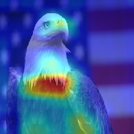
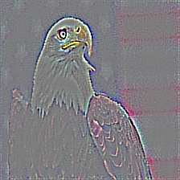

## Grad-CAM implementation ##

Gradient-weighted Class Activation Mapping (Grad-CAM):
It uses the class-specific gradient information flowing into the final convolutional layer of a CNN to produce a coarse localization map of the important regions in the image. 

See the paper: https://arxiv.org/pdf/1610.02391v1.pdf

The original torch implementation: https://github.com/ramprs/grad-cam

This code assumes Tensorflow dimension ordering, and uses the VGG16 network in keras.applications by default (the network weights will be downloaded on first use).

Usage: `python gradcam.py <path_to_image>`

##### Example

'Bald eagle, American eagle, Haliaeetus leucocephalus' (22 in keras)

