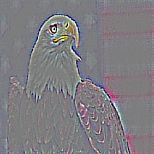

## Grad-CAM implementation ##

Gradient class activation maps are a visualization technique for deep learning networks.

See the paper: https://arxiv.org/pdf/1610.02391v1.pdf

The paper authors torch implementation: https://github.com/ramprs/grad-cam

This code assumes Tensorflow dimension ordering, and uses the VGG16 network in keras.applications by default (the network weights will be downloaded on first use).

Usage: `python gradcam.py <path_to_image>`

##### Examples

'Bald eagle, American eagle, Haliaeetus leucocephalus' (22 in keras)

